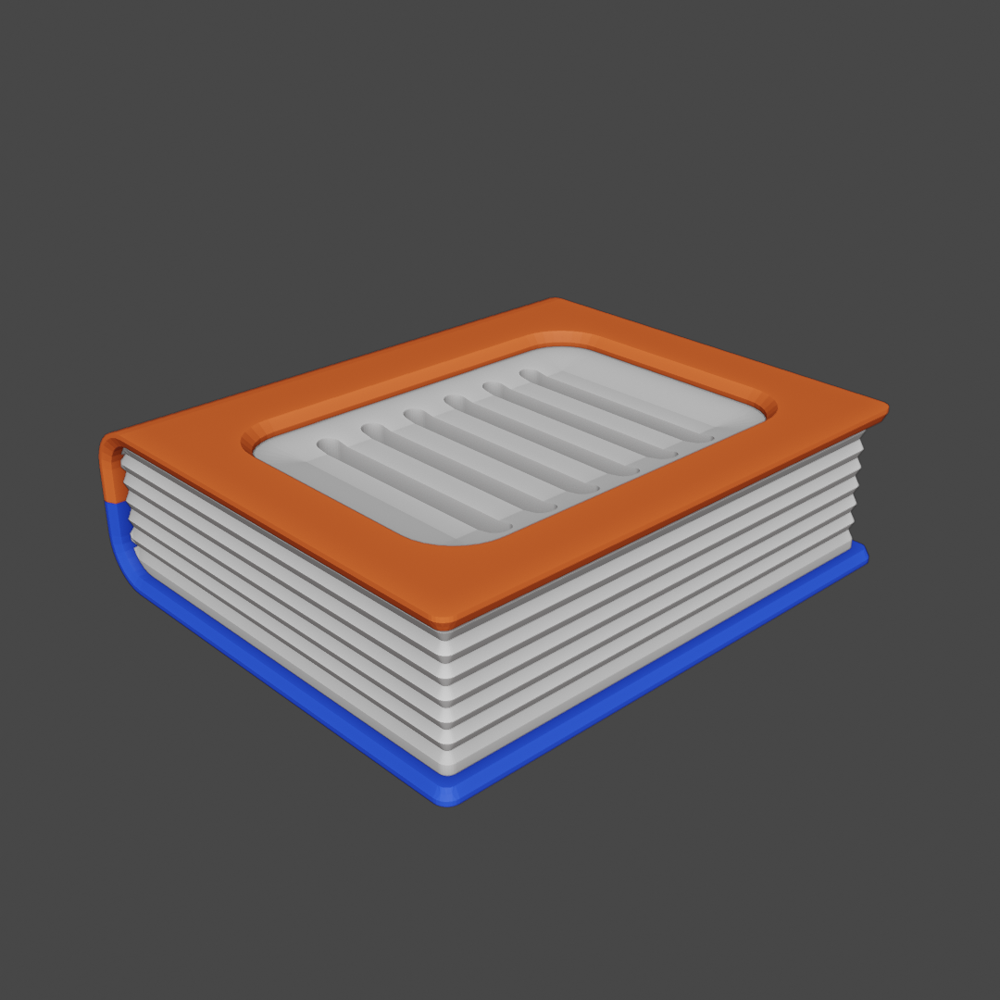
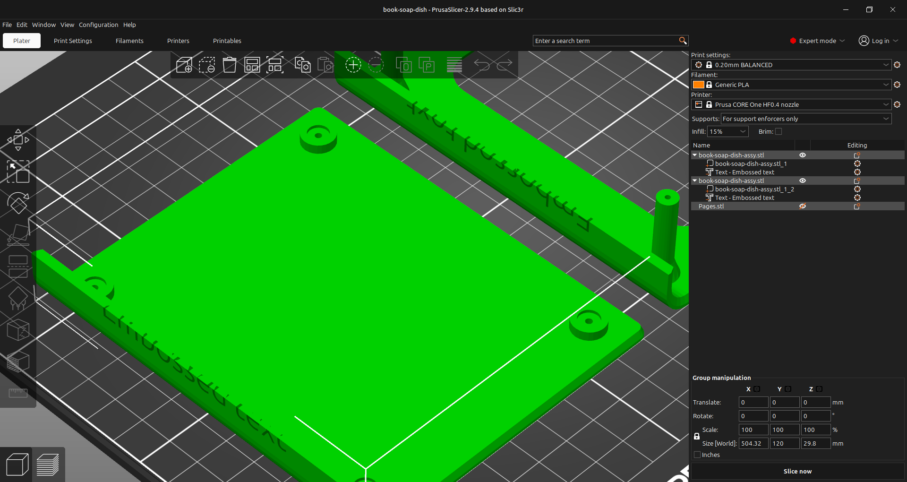

# Book Soap Dish

- Download from Printables here: [`Download Link`](https://www.printables.com/model/1631224-book-soap-dish)
- Download from Thingiverse here: [`Download Link`](https://www.thingiverse.com/thing:7311305)

## Summary

A soap dish in the shape of a book!

* * *

# Summary

A soap dish in the shape of a book!

# Print Settings

- Supports: None
- Infill: 15%
- Brim: false

# Bill of Materials & Assembly

- (See Notes below)

# Additional Information

- **Notes**
    - Assembly is optional. If you choose to fasten the cover to the back part, you will need four M2 screws.
    - You can add rubber feet to the back part by adhering self adhesive bumpers to the four recessed slots on the bottom.
- **Optional**
    - You can use the embossed text in the 3MF file to customize the book's title on the spine.

* * *

# Previews

